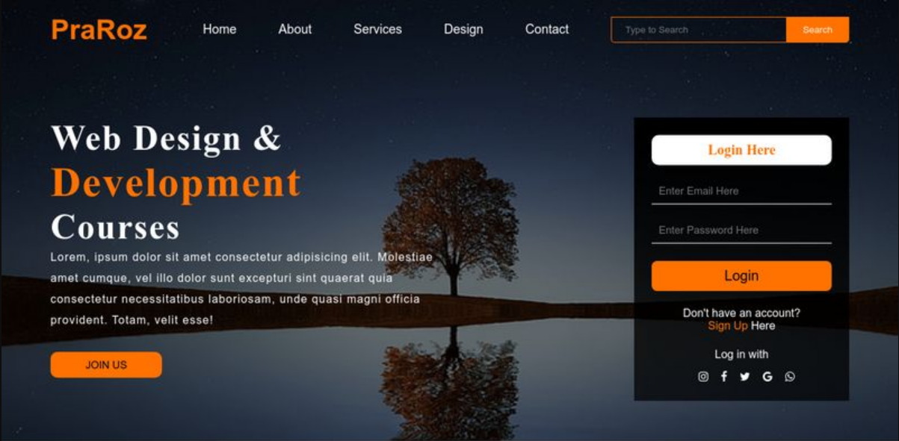

# TP PraRoz

L'objectif de ce tp est d'analyser le code de base du site de PraRoz et d'identifier les erreurs tout en proposant des solutions.

Par la suite les solutions de modifications doivent être appliqué sur le code afin qu'il puisse respecter les normes de W3C, l'accessibilité et la responsive.

Le langage qui doit être utiliser est le langage HTML,CSS et JS.

# HTML
Le code n'est pas sémantique.

Absence de la balise ``<header>``

 Balise ``<meta>`` absente.

``<H1>`` mal placé et doit être place à la place du ``<H2>`` dans une balise ``<header>`` qui n'est pas présent dans le code.

Balise ``<button>`` dans une balise a (2 fois).

Mettre une balise ``<main>`` a la place de ``
``

Privilégier l'utilisation de balise ``<section>`` a la place des balise ``
``

Attribut ``name = ""`` vide (2 fois).

Fermeture de la balise ``<a>`` deja effectué.

Deux fermeture de balise ``
`` en trop.

Accessibilité négligé.

Code ne passe pas le W3C Validator.

# CSS

Compléter le reset qui est incompatible.

Remplacer les valeurs px en rem.

Absence de responsive.

Présence de code inutile dans la css.

# JS

Absence de DOM.

Remplacer les var par let.

